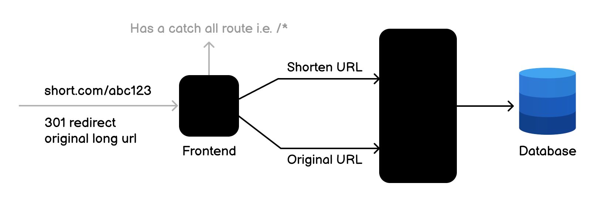

# URL Shortener API

A simple and efficient RESTful API for shortening long URLs. This service provides a complete CRUD interface for managing shortened URLs along with access statistics tracking.



## Features

- Create shortened URLs with randomly generated unique short codes
- Retrieve original URLs from short codes
- Update existing shortened URLs
- Delete shortened URLs
- Track and retrieve access statistics for each shortened URL
- RESTful API design with proper HTTP status codes
- Input validation and error handling

## Tech Stack

- Ruby on Rails (API-only mode)
- PostgreSQL database
- RESTful API architecture

## Getting Started

### Prerequisites

- Ruby 3.x
- Rails 8.x
- PostgreSQL

### Installation

1. Clone the repository:
```bash
git clone <repository-url>
cd URLShortenerAPI
```

2. Install dependencies:
```bash
bundle install
```

3. Setup the database:
```bash
rails db:create
rails db:migrate
```

4. Start the server:
```bash
rails server
```

The API will be available at `http://localhost:3000`

## API Endpoints

### Create Short URL

Creates a new shortened URL with a randomly generated unique short code.

**Endpoint:** `POST /shortens`

**Request Body:**
```json
{
  "url": "https://www.example.com/some/long/url"
}
```

**Success Response:**
- **Status Code:** 201 Created
```json
{
  "id": "1",
  "url": "https://www.example.com/some/long/url",
  "shortCode": "abc123",
  "createdAt": "2021-09-01T12:00:00Z",
  "updatedAt": "2021-09-01T12:00:00Z",
  "accessCount": 0
}
```

**Error Response:**
- **Status Code:** 422 Unprocessable Entity
- Returns validation error messages

---

### Retrieve Original URL

Retrieves the original URL from a short code.

**Endpoint:** `GET /shortens/:shortCode`

**Example:** `GET /shortens/abc123`

**Success Response:**
- **Status Code:** 200 OK
```json
{
  "id": "1",
  "url": "https://www.example.com/some/long/url",
  "shortCode": "abc123",
  "createdAt": "2021-09-01T12:00:00Z",
  "updatedAt": "2021-09-01T12:00:00Z",
  "accessCount": 0
}
```

**Error Response:**
- **Status Code:** 404 Not Found
- Returns when the short code doesn't exist

---

### Update Short URL

Updates the target URL for an existing short code.

**Endpoint:** `PUT /shortens/:shortCode`

**Example:** `PUT /shortens/abc123`

**Request Body:**
```json
{
  "url": "https://www.example.com/some/updated/url"
}
```

**Success Response:**
- **Status Code:** 200 OK
```json
{
  "id": "1",
  "url": "https://www.example.com/some/updated/url",
  "shortCode": "abc123",
  "createdAt": "2021-09-01T12:00:00Z",
  "updatedAt": "2021-09-01T12:30:00Z",
  "accessCount": 0
}
```

**Error Responses:**
- **Status Code:** 422 Unprocessable Entity (validation errors)
- **Status Code:** 404 Not Found (short code doesn't exist)

---

### Delete Short URL

Deletes an existing shortened URL.

**Endpoint:** `DELETE /shortens/:shortCode`

**Example:** `DELETE /shortens/abc123`

**Success Response:**
- **Status Code:** 204 No Content

**Error Response:**
- **Status Code:** 404 Not Found
- Returns when the short code doesn't exist

---

### Get URL Statistics

Retrieves access statistics for a shortened URL.

**Endpoint:** `GET /shortens/:shortCode/stats`

**Example:** `GET /shortens/abc123/stats`

**Success Response:**
- **Status Code:** 200 OK
```json
{
  "id": "1",
  "url": "https://www.example.com/some/long/url",
  "shortCode": "abc123",
  "createdAt": "2021-09-01T12:00:00Z",
  "updatedAt": "2021-09-01T12:00:00Z",
  "accessCount": 10
}
```

**Error Response:**
- **Status Code:** 404 Not Found
- Returns when the short code doesn't exist

## Usage Examples

### Using cURL

Create a shortened URL:
```bash
curl -X POST http://localhost:3000/shortens \
  -H "Content-Type: application/json" \
  -d '{"url": "https://www.example.com/some/long/url"}'
```

Retrieve original URL:
```bash
curl http://localhost:3000/shortens/abc123
```

Get statistics:
```bash
curl http://localhost:3000/shortens/abc123/stats
```

Update URL:
```bash
curl -X PUT http://localhost:3000/shortens/abc123 \
  -H "Content-Type: application/json" \
  -d '{"url": "https://www.example.com/new/url"}'
```

Delete URL:
```bash
curl -X DELETE http://localhost:3000/shortens/abc123
```

## Development

### Running Tests
```bash
rails test
```

### Database Management
```bash
rails db:migrate        # Run pending migrations
rails db:rollback       # Rollback last migration
rails db:seed           # Load seed data
rails db:reset          # Drop, create, migrate, and seed database
```

https://roadmap.sh/projects/url-shortening-service